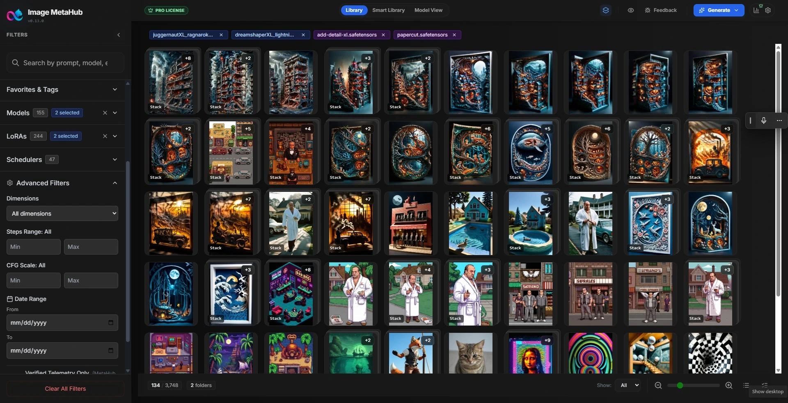

# Image MetaHub

*Local AI image browser and metadata hub for AI images from Stable Diffusion and related tools.*



## What is Image MetaHub?

Image MetaHub is a **local image browser and manager** focused on AI‑generated images.
It scans your folders, parses metadata from popular tools (Automatic1111, ComfyUI, Fooocus, SD.Next, Forge, SwarmUI, DrawThings) and online services like Midjourney / Nijijourney, whenever their metadata is present in the files. and lets you search, filter and organize your images by prompt, model, sampler, seed and more – all **offline**, on your machine.

It is open‑source (MPL 2.0) and free to use, with optional **Pro features** for power users.

> *Previously known as **"Image Metadata Browser for Stable Diffusion"** – renamed as the project grew beyond just SD.*

---

## Key features (overview)

* **Fast local browser** for AI images (no accounts, no cloud, no telemetry)
* **Rich metadata parsing** for Stable Diffusion / A1111 / ComfyUI and other tools
* **Powerful search & filters** by prompt text, model, steps, CFG, sampler, seed, etc.
* **Tagging & organization** to build your own curated libraries
* **Compare tools** to inspect variations side‑by‑side (Pro)
* **Analytics dashboard** to see how you actually generate and use your models (Pro)
* **Automatic1111 integration** to send images/settings back to A1111 directly (Pro)

Below sections go into more detail – but if you just want to try it, jump to **Getting started**.

---

## Free vs Pro

Image MetaHub is developed as a hybrid model:

* The **core app is free and open‑source (MPL 2.0)** – this repository.
* Some **advanced workflow features are Pro** and require a license key to unlock in the desktop app.

**Free (core) includes for example:**

* Scanning folders and caching metadata
* Browsing, searching and filtering images
* Basic collections / organization features

**Pro currently unlocks:**

* Automatic1111 integration (send prompts/settings back and forth)
* Compare panel
* Analytics dashboard

The goal is to keep the core tool open and useful for everyone, while making heavy‑duty workflow features help sustain the project.

---

## Getting started

1. **Download the latest release**

   * Go to the [Releases](https://github.com/LuqP2/Image-MetaHub/releases) page and grab the installer for your platform (Windows / Linux / macOS).

2. **Install and run**

   * Launch Image MetaHub.

3. **Add your image folders**

   * Point the app to the directories where you keep your AI‑generated images.
   * Image MetaHub will scan and index them, reading metadata where available.

4. **Start browsing & filtering**

   * Use the search bar and filters (model, sampler, steps, seed, etc.) to narrow down results.


For more detailed options (CLI, dev setup, advanced config), see the sections below.

---

## Metadata support

Image MetaHub parses metadata from:

* Stable Diffusion / Automatic1111 images (PNG info, etc.)
* ComfyUI (partial coverage; parser is actively being extended)
* Fooocus
* SD.Next
* Forge
* SwarmUI
* DrawThings
* Online services like Midjourney / Nijijourney (when prompts/settings are saved into the downloaded files)
* Other tools that store generation parameters in PNG/JPG metadata

> Note: ComfyUI support is still evolving and may not cover every custom node or complex workflow yet.
>
> If Image MetaHub does not read the metadata from your ComfyUI images yet, please open an issue with your workflow / sample images and that format will be added in the next update whenever possible.

If a tool writes prompt / settings in a consistent way, Image MetaHub can usually read it. The parsers are extensible and can be updated as new formats appear.


---

## Automatic1111 integration (Pro)

With Pro enabled, Image MetaHub can talk directly to a running Automatic1111 instance:

* Send prompts / params from an image back into A1111
* Quickly re‑generate, tweak or upscale based on previous images

Basic flow:

1. Enable the API flag in your A1111 setup (`--api`).
2. Configure the A1111 endpoint in Image MetaHub settings.
3. Use the integration actions from image details / context menus.

For step‑by‑step instructions, see the dedicated docs in this repo.

---

## Compare panel (Pro)

The compare panel lets you:

* Pin multiple images and inspect them side‑by‑side
* Compare prompts, seeds, models and other settings
* Study subtle differences between variations


---

## Analytics dashboard (Pro)

The analytics dashboard gives you a high‑level view of your generation patterns, such as:

* Most used models / samplers
* Resolution / aspect ratio distributions
* Trends over time

It’s built to help you understand how you actually work with your tools, based on your existing images.


---

## Development

This repo contains the full source code for the core app.

* **Tech stack:** Electron, React, TypeScript, Vite
* **License:** MPL 2.0

Basic dev commands:

```bash
# install dependencies
npm install

# run in dev mode
npm run dev:app

# build production bundle
npm run build

# build desktop app (no publish)
npm run electron-dist
```

If you’re interested in contributing (bugfixes, parser support, UX tweaks, etc.), feel free to open an issue or PR.

---

## Privacy

Image MetaHub is designed to be **local‑first**:

* Your libraries and metadata stay on your machine.
* No mandatory account, no remote server dependency.
* Network calls are limited to features that explicitly need them (e.g. A1111 integration, update checks).

---

## Roadmap

High‑level focus areas:

* Better ComfyUI coverage and parser improvements
* More robust tagging and library organization tools
* Quality‑of‑life improvements in browsing / filtering / compare
* More flexible analytics for power users

For detailed issues and planned work, check the [Issues](https://github.com/LuqP2/Image-MetaHub/issues) and project board.

---

## Credits

Image MetaHub is built and maintained by **Lucas (LuqP2)**, with feedback and contributions from the community.

If you find it useful and want to support development, consider upgrading to Pro or starring the repo on GitHub.
