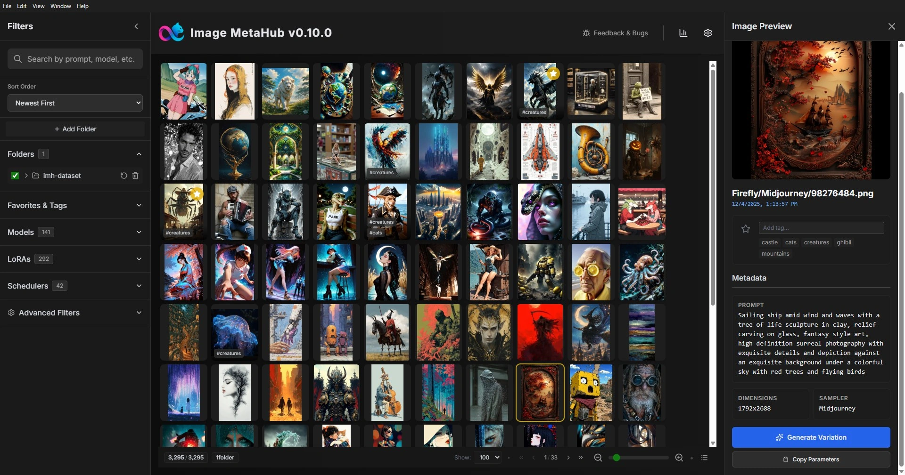
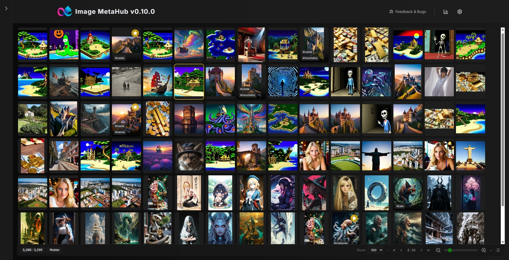
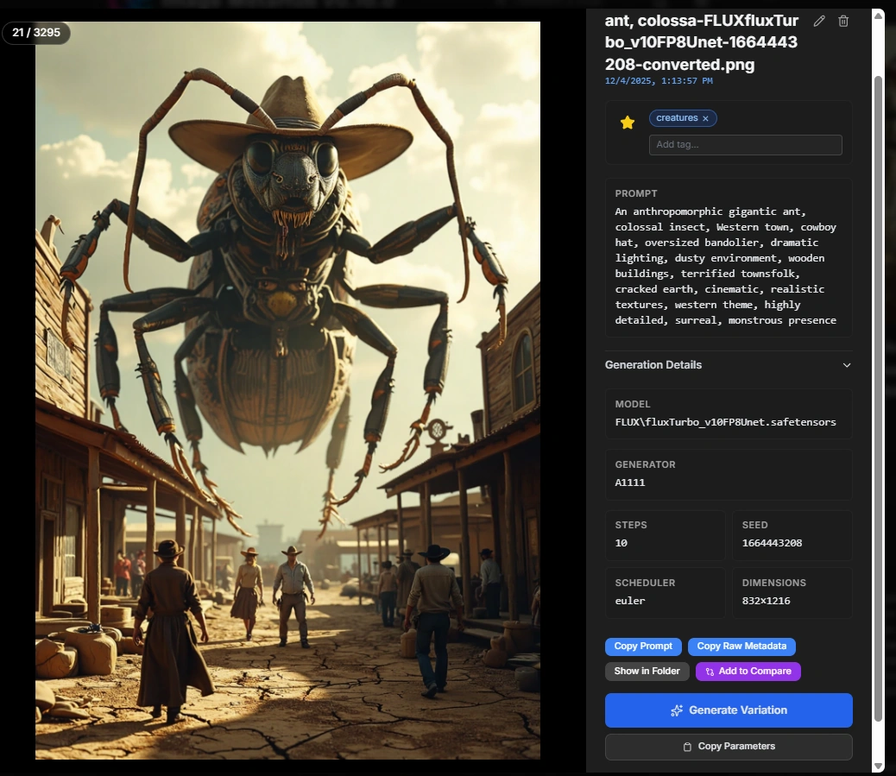
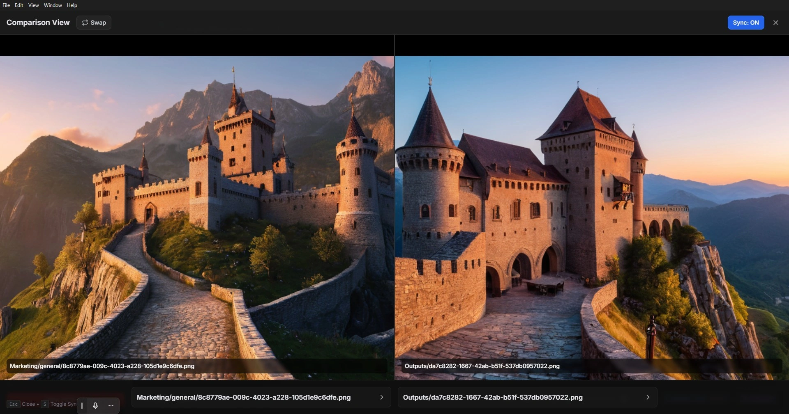
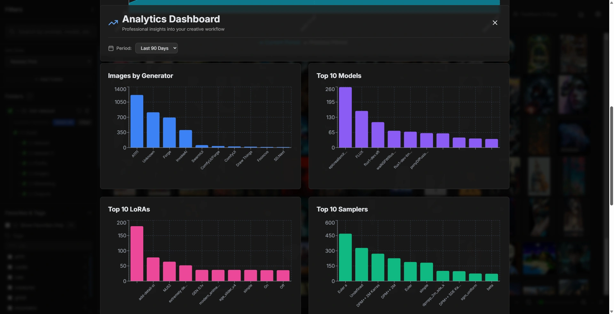

# Image MetaHub

[](https://imagemetahub.com/getpro)
[](https://ko-fi.com/lucaspierri)

Local-first browser, search tool, and metadata hub for AI-generated images and videos.



## What is Image MetaHub?

Image MetaHub is a desktop app for browsing large local libraries of AI outputs without uploading anything to the cloud. It scans your folders, extracts metadata from popular generators, caches results for fast reuse, and lets you filter by prompt, model, LoRA, sampler, seed, dimensions, telemetry, tags, and more.

It started as a local browser for InvokeAI outputs and has since grown into a broader metadata hub for Stable Diffusion ecosystems, ComfyUI workflows, and related tools.

## Highlights

* Local-first browsing with no mandatory account, no cloud sync, and no outbound telemetry
* Fast indexing and thumbnail caching for large libraries
* Metadata parsing for Automatic1111, ComfyUI, InvokeAI, SD.Next, Forge, SwarmUI, Fooocus, Draw Things, Midjourney/Niji, Firefly, DreamStudio, DALL-E, and more
* Support for PNG, JPG, JPEG, WEBP, GIF, MP4, WEBM, MKV, MOV, and AVI
* Faceted sidebar filters with explicit include/exclude actions for checkpoints, LoRAs, samplers, schedulers, ratings, generation modes, media types, and verified telemetry
* Dedicated Node View for browsing embedded ComfyUI workflow node types
* Image lineage detection for `img2img`, `inpaint`, and `outpaint`, including source-image recovery when possible
* Multi-window image viewer with move, resize, docking/collapsible details, and fast cross-reference workflows
* Smart Library with prompt clustering, TF-IDF auto-tags, manual tag management, and deduplication helpers
* Startup verification modes for reopening saved libraries from cache or validating them against disk
* Automatic1111 and ComfyUI integrations with queueing, progress tracking, and optional launcher shortcuts
* Analytics Explorer and verified metrics support for images generated with the MetaHub Save Node

## Free vs Pro

The repository is MPL 2.0 and the core app remains open-source. Some workflow-heavy features are unlocked through the desktop app's offline Pro license or 3-day trial.

**Core app includes:**

* Local indexing, metadata parsing, search, sort, and filtering
* Tags, favorites, safe mode, and shadow metadata editing
* Auto-watch for generation folders
* Image lineage display and multi-window viewer workflows
* Smart Library auto-tags and clustering with free-tier limits
* Deduplication helpers and stack browsing

**Pro currently unlocks:**

* Automatic1111 generation and parameter copy workflows
* ComfyUI generation, workflow-native editing, and progress tracking
* Compare View with 2-4 image layouts and metadata diff tools
* Analytics Explorer
* Batch export
* Bulk tagging
* In-app file management (copy/move between indexed folders)
* Unlimited clustering scale

## Getting Started

1. Download the latest desktop release from [GitHub Releases](https://github.com/LuqP2/Image-MetaHub/releases).
2. Install and launch Image MetaHub.
3. Add one or more folders that contain your generated images or videos.
4. Wait for the first indexing pass to finish.
5. Use search, sidebar facets, tags, and advanced filters to explore the library.

### macOS unsigned builds

Current GitHub release builds are not signed with an Apple Developer ID yet. If macOS blocks the app after you download and move it to Applications, remove the quarantine flag from Terminal:

```bash
xattr -dr com.apple.quarantine "/Applications/Image MetaHub.app"
```

This is a temporary workaround for unsigned builds until macOS signing and notarization are available.



## Browsing and Curation

Image MetaHub is built around fast local curation:

* **Search + facets**: combine free-text search with include/exclude facets for checkpoints, LoRAs, samplers, schedulers, tags, favorites, ratings, generation modes, media types, and advanced ranges
* **Stacking**: group identical prompts in the main library view for faster browsing
* **Manual tags + ratings**: keep a persistent manual tag catalog, switch included tags between `Any` and `All`, and curate with 1-5 ratings
* **Metadata recovery**: reparse selected images without running a full folder refresh or clearing cache
* **Startup verification**: choose whether saved folders reopen from cache, reconcile in the background, or verify strictly before startup completes
* **Shadow metadata**: edit metadata non-destructively and keep the original payload available for inspection or revert
* **Viewer workflows**: open multiple image windows, minimize them into the footer, and navigate derived/source images through lineage
* **Auto-watch**: keep output folders in sync while A1111 or ComfyUI is generating

## Smart Library

The Smart Library groups similar prompts into stacks and adds metadata-derived discovery tools for large collections.

* **Prompt clustering**: background worker groups visually related images by prompt similarity
* **TF-IDF auto-tags**: generate useful tags from prompts, models, LoRAs, and workflow metadata
* **Stack browsing**: open a stack, paginate inside it, and keep navigation context in the image viewer
* **Deduplication helper**: rank likely keep/archive candidates and estimate space savings
* **Free-tier limits**: the open-source app includes Smart Library workflows, while Pro removes clustering scale limits

## ComfyUI Node View

For libraries that include embedded ComfyUI workflows, Image MetaHub can switch into a dedicated node browser:

* Search exact node-type names across the current scope
* Multi-select node filters with OR matching
* See per-node result counts before applying a filter
* Jump straight from node-filtered results back into the normal image viewer workflow

## Metadata Support

Image MetaHub reads metadata from:

* Stable Diffusion / Automatic1111 images
* ComfyUI workflows and prompt graphs
* InvokeAI
* SD.Next
* Forge
* Fooocus
* SwarmUI
* Draw Things
* Midjourney / Niji Journey
* Adobe Firefly
* DreamStudio
* DALL-E
* Other tools that embed generation parameters into PNG/JPEG/WebP metadata or sidecar payloads

Supported media types:

* **Images**: PNG, JPG, JPEG, WEBP, GIF
* **Video**: MP4, WEBM, MKV, MOV, AVI

For video metadata, Image MetaHub uses container metadata plus `ffprobe` when available to extract duration, codec, frame count, and resolution.

### MetaHub Save Node

For ComfyUI, the best experience comes from the companion [ImageMetaHub Save Node](https://github.com/LuqP2/ImageMetaHub-ComfyUI-Save) on the [ComfyUI Registry](https://registry.comfy.org/publishers/image-metahub/nodes/imagemetahub-comfyui-save).

With the Save Node, Image MetaHub can ingest:

* Full workflow and prompt payloads
* Tags and notes saved by the workflow
* GPU and timing analytics
* Verified telemetry badges and filters
* Explicit lineage metadata for derived images

For older ComfyUI images without the node, Image MetaHub still attempts best-effort parsing from embedded workflow data.



## Image Lineage and Viewer

The image viewer is no longer just a single modal. In the current app it supports:

* Multiple open image windows at the same time
* Move, resize, minimize, maximize, and focus management
* Docked or collapsed detail panels
* Lineage display for transformations like `img2img`, `inpaint`, and `outpaint`, including generation-type and denoise context when available
* Source-image recovery from explicit references or inferred metadata when possible
* Derived-image previews to navigate transformation chains

## Automatic1111 Integration (Pro)

With Pro enabled, Image MetaHub can talk directly to a running Automatic1111 instance.

Main workflows:

* **Copy to A1111**: format metadata into A1111's three-line parameter block for the blue-arrow import flow
* **Generate with A1111**: send normalized metadata directly to the API for quick regeneration
* **Model and LoRA selection**: browse available models/LoRAs and override prompt parameters before generation
* **Queue-aware progress**: generations feed the shared queue and progress surfaces

Basic setup:

1. Start A1111 with `--api`.
2. If needed, allow the app origin with `--cors-allow-origins=http://localhost:5173`.
3. Configure the server URL in Image MetaHub settings.

## ComfyUI Integration (Pro)

With Pro enabled, Image MetaHub can generate through ComfyUI using either the original embedded workflow or a safe metadata rebuild.

**Current flow:**

1. Open an image with compatible metadata.
2. Click `Generate with ComfyUI`.
3. Choose `Original workflow` or `Simple rebuild`.
4. Adjust prompt, negative prompt, seed, steps, CFG, dimensions, model overrides, LoRAs, and source image policy when relevant.
5. Optionally use the visual workflow editor or advanced JSON editor.
6. Queue the workflow to ComfyUI and follow progress in real time over WebSocket.

**What exists today:**

* **Workflow-native mode** for executable embedded prompt graphs
* **Simple rebuild mode** for metadata-only images
* **Visual workflow inspector/editor** with pan/zoom and per-node field editing
* **Model-family aware overrides** for checkpoints, UNETs, VAEs, CLIP loaders, and LoRAs when supported
* **Transform-aware source image policies** for img2img/inpaint-style workflows
* **Shared queue** with retry, cancel, and cleanup actions
* **Metadata-rich outputs** when used with the MetaHub Save Node and Timer node

**Setup:**

1. Run ComfyUI locally, usually on `http://127.0.0.1:8188`.
2. Install the MetaHub Save Node.
3. Configure the ComfyUI URL in settings.
4. Optionally save a local launch command so the desktop header can start or reopen ComfyUI for you.
5. Test the connection from the app and start generating.

## Compare View (Pro)

Image MetaHub currently supports comparing **up to 4 images** with:

* Side-by-side mode with optional synchronized zoom/pan
* Side Strip and 2x2 Grid layouts for 3-4 image sets
* Slider mode
* Hover mode
* Metadata comparison in standard or diff view
* Quick swap and keyboard shortcuts



## Analytics (Pro)

The Analytics Explorer summarizes library usage and, when telemetry is available, generation performance:

* `Overview`, `Resources`, `Time`, `Performance`, and `Curation` views
* Scope switching between the current filtered results and the full library
* Cohort comparisons for generators, models, LoRAs, samplers, GPU devices, ratings, and more
* One-click promotion of analytics insights into live filters
* Verified telemetry coverage
* Average speed, VRAM, and generation time for MetaHub Save Node images
* Performance charts grouped over time or by GPU



## Development

This repository contains the desktop app source code.

**Stack:**

* React 18 + TypeScript
* Electron
* Zustand
* Vite
* Tailwind CSS
* Vitest

**Common commands:**

```bash
npm install
npm run dev
npm run dev:app
npm run build
npm run electron-dist
npm run test
npm run lint
```

**CLI helpers:**

```bash
npm run cli:parse -- path/to/file.png --pretty --raw
npm run cli:index -- path/to/folder --out index.jsonl --recursive
```

For release work, see [RELEASE-GUIDE.md](RELEASE-GUIDE.md) and [RELEASE-AUTOMATION.md](RELEASE-AUTOMATION.md).

## Privacy

Image MetaHub is designed to stay local:

* Your files, cache, tags, and metadata stay on your machine.
* There is no required account system.
* Pro licenses are validated offline.
* Network activity is limited to things that explicitly need it, such as:
  * auto-update checks
  * local A1111 / ComfyUI APIs
  * links you choose to open

## Credits

Image MetaHub is built and maintained by **Lucas (LuqP2)** with community feedback and contributions.

## Links

* Website: [https://imagemetahub.com](https://imagemetahub.com)
* Pro license: [https://imagemetahub.com/getpro](https://imagemetahub.com/getpro)
* Ko-fi: [https://ko-fi.com/lucaspierri](https://ko-fi.com/lucaspierri)
* ComfyUI Save Node: [https://github.com/LuqP2/ImageMetaHub-ComfyUI-Save](https://github.com/LuqP2/ImageMetaHub-ComfyUI-Save)
